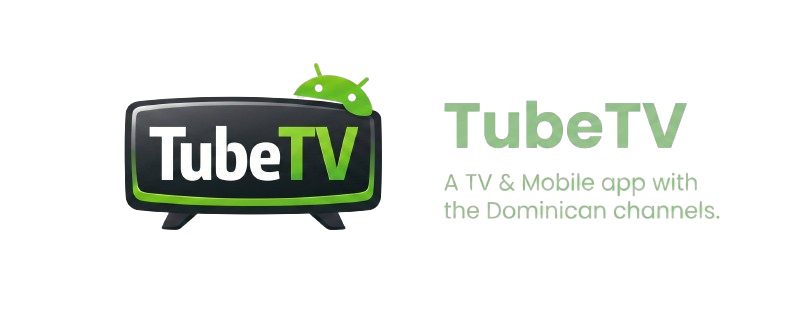

## a tv & mobile app with the dominican channels and more.

<p align="center">
  
</p>

<u>**⚠️ This App may be stable or not, if any channel stops working, please report it. We will offer new updates whenever we can.**</u>

---

## Setup

This project uses Firebase (analytics + crashlytics), so you need to provide your own `google-services.json` to build it.

### Adding google-services.json

1. Go to the [Firebase Console](https://console.firebase.google.com) and create a project (or open an existing one)
2. Add an Android app with the package name `io.tubetvlol.tubetv`
3. Download the `google-services.json` file
4. Place it inside the `tv/` folder:

```
TubeTV/
└── tv/
    └── google-services.json   <-- here
```

5. Build the project normally

---

## Credits

Fully coded by **F3l1x** (aka: xzyyysh)

```
( ^ ‿ ^ )
```